### Final Project: Dual-Tone Multi-Frequency Detector, C2C Bruno Graziano, ECE 383

#### Proposal
The objective is to build a portable and standards-compliant dual-tone multi-frequency (DTMF) listener and alpha-numeric T9-type text editor (or, at least, a numeric-only entry system like on a landline) in order to communicate by text through sound. This is also to practice building with documentational clarity, modularity, and with user-configuration in mind.

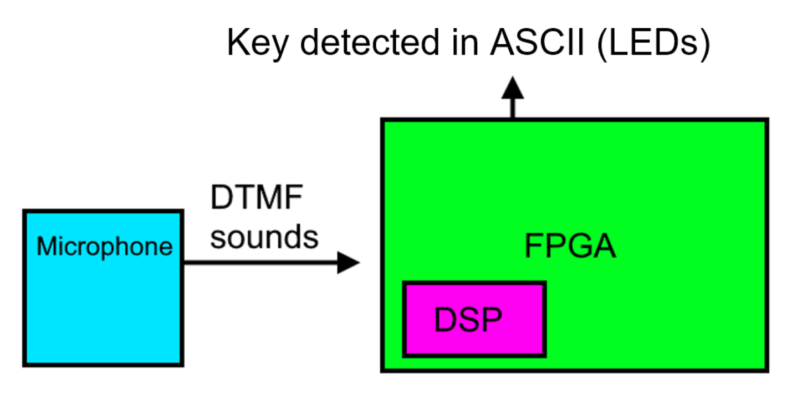
Figure 1. High-level architecture of the DTMF detector.
  
The Nexus Video's on-board DSP (digital signal processing) will be used in the calculations (repeated multiplication) required to discern the incoming DTMF, even if no "DSP" module is explicitly instantiated in the VHDL. The dotted lines are to say that at least one of these connected display devices would be integrated. A microphone will also be used, integrated as an analog audio source.

#### Detailed Architecture and Sub-System Design
##### Level-0 Design
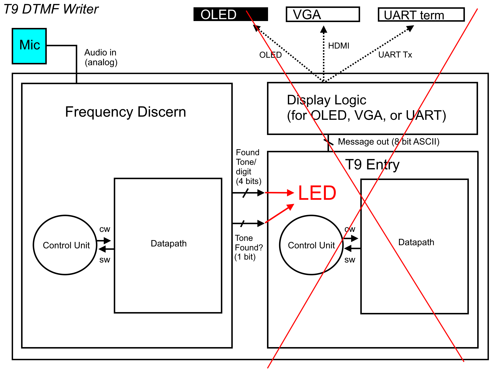
Figure 2. The proposed architecture with all planned modules (Frequency Discern, T9, and Display Logic) abstracted to datapath and control. The two main modules would have divided into each's own set of datapath and control. 
  
"Tone Found?" is a bit expressing whether a DTMF tone (again, two specific frequencies) is currently being reliably detected from the audio input... or in short, whether someone is currently found to be pressing a key at all. The decision for what to implement for the display and efforts towards T9 alpha-numeric entry were to be deferred until after the Frequency Discern unit was finished, and since the Frequency Discern unit is not fully working, those following modules were passed over, and LEDs were implemented to display the current detected key.
  
##### DTMF
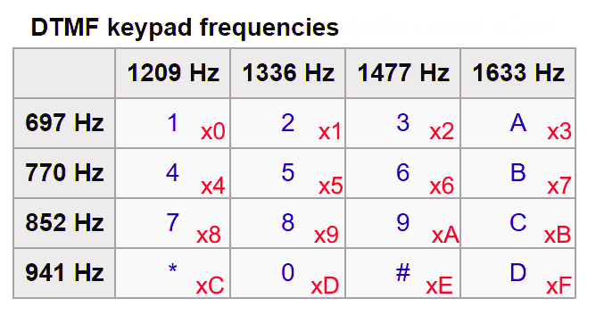
Figure 3. DTMF keypad model. DTMF started in 1963 under the trademark "TouchTone" by Bell Labs, and since has become an open standard everywhere. Keys include all digits, *, #, and A B C D on the right. That 4th column, uncommon to landlines and cell phones, is still used today by networking and amateur radio (Wikipedia). When one key is pressed on a DTMF pad, It plays a sound that is a sum of the row frequency and column frequency shown. For example is "4" was pressed, 770 Hz (the row "4" is in) and 1209 Hz (the column "4" is in) play at the same time; a sum of two pure sines. The reason the frequencies are odd values is so that none of them are harmonics (multiples) of each other, and also for voice processing and clarity reasons. The red hex enumerations on each key are there for the decision of the tone, and better explained in detail after having gone over the datapath.

##### Datapath
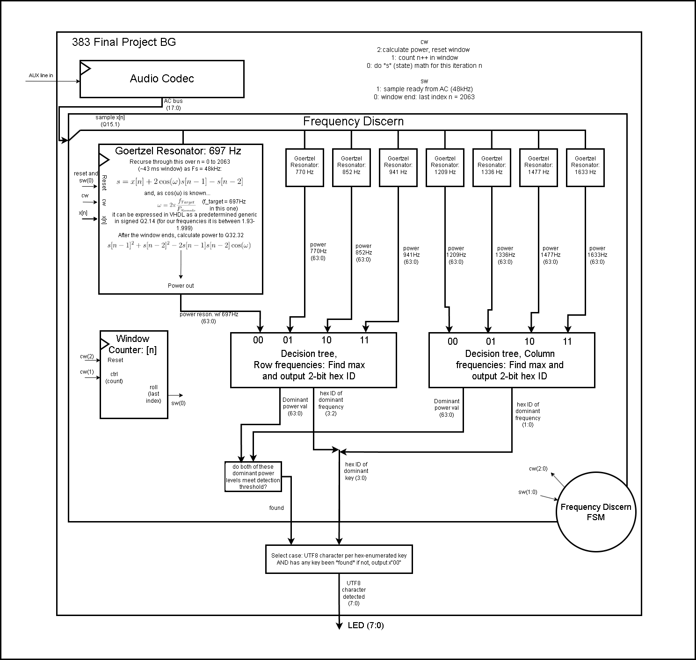
Figure 4. An updated, lower-level diagram of the entire project's completed datapath. The FSM is abstracted; its diagram will be shown later. Control and status bits are defined above to the right of the Audio Codec. The Audio Codec turns an analog AUX signal into an 18-bit signed value sampled at 48 kHz, which is an input (after having been truncated to 16 bits and treated as a fixed point Q15.1) to, inside the Frequency Discern unit, eight "Goertzel Resonators," which are in place to determine correlation values between the heard sound signal and each tuned target frequency. "found" and "key" are the same things as "Tone found?" and "Found tone" from Figure 2 respectively. 
##### Datapath - Goertzel
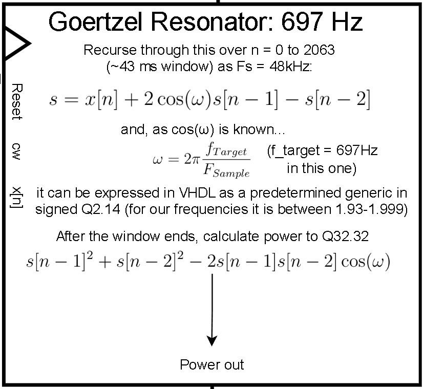
Figure 5. Goertzel Resonator. The name is for the Goertzel algorithm, a recursive calculation of a state variable "s" or "s[n]" which adds the input signal x[n] to a predetermined coefficient 2cosω times the previous state value s[n-1] and subtracts s[n-2] from that. 2cosω is known beforehand because ω is the target frequency divided by the sampling frequency (it is like saying cos(2π*f*t) because time in sampling = nT, n being the sample index and T being the sampling period. "n" is not included in Goertzel's ω, so the result 2cosω only varies if the target frequency varies. Therefore there are eight coefficients to consider, available in our VHDL as generic constants (next figure). That state formula is like a differential equation in digital signal processing; a transfer function can be derived from it. If the target frequency is close to the frequency of x[n], then the state variable increases faster (it resonates more powerfully). The longer the window, the larger s gets. Our window (2064 samples, 43 ms) will produce a final (end of the window) s-value on the order of 10^3 when the signal and target frequencies match. It would be much larger if x[n] was not normalized to signed Q1.15. More on Q.Q math can be found in the Appendix. Final s is high when matching, low when not matching. To find correlation power values, following Figure 3, there are eight resonators because there are eight target frequencies - four lower on the rows, and four higher on the columns. All resonators work in parallel according to the single FSM. At every window's end (every 43 ms), the power will be calculated. The formula is seen in the figure. It gives the same result as (and is a rearranged version of) I^2 + Q^2, which stand for "in-phase" and "quadrature" (out of phase by 90 degrees), or in other words real^2 + imaginary^2. After calculating power in parallel, those values are compared to find the highest resonance out of the four row frequencies and the highest resonance out of the four column frequencies, which intersect over the key we conclude was heard.
More details and graphs of the Goertzel response can be found in the Appendix.
##### FSM
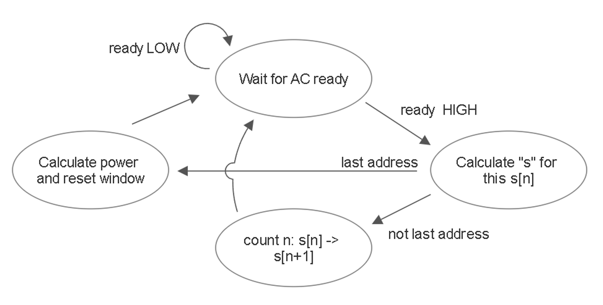
Figure 9. FSM for Frequency Discern. The "last address" or end of window is n = 2063. The state of calculating power and resetting the window tells the Goertzel resonator units such through the control word, who then calculate this window's power result and then reset themselves (reset state variable s[n] to 0, s[n-1] = 0, s[n-2] = 0).

##### Decision
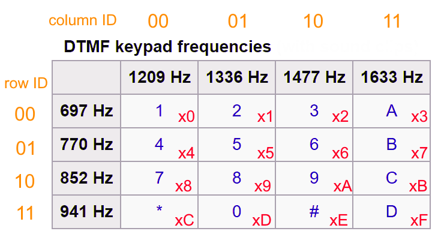
"key" (the same thing as "Found Tone" from Figure 2) is 4 bits or one hex digit representing the value of a key, following the diagram below.

\includegraphics[width=1\textwidth]{level1deep}

\pagebreak

\section{Calculations, Analysis, Drawings.}
\[s = x[n] + 2\cos(\omega)s[n-1] - s[n-2]\]

when \[\omega = 2\pi \frac{f_{Target}}{F_{Sample}} = 2\pi f_{Target}T_{s}\]

as discrete time (for sampling) is represented as
\[t = nT_{s} = \frac{n}{F_{Sample}}\]

and the power calculation is
\[s[n-1]^2 + s[n-2]^2 - 2s[n-1]s[n-2]\cos(\omega)\]

To find whether a desired frequency is detected in a signal input, you can do a discrete kind of Fourier transform that looks like a summation of samples, with 'n' being the current address in the BRAM, and 'x' being the value of the current sample:
\[ \sum_{n=0}^{\# addresses} x e^{j2\pi f_{desired}t} \] 
That is, to multiply each sample by a sinusoud of whose frequency is the desired. The trigonometric identity
\[A\cos(listened freq)B\cos(desired freq) = \frac{AB}{2}\cos(listened - desired) + \frac{AB}{2}\cos(listened + desired)\] \[\sin(2)\]
shows that how close the tested and desired frequencies are is how close the result is to having a frequency of 0 Hz seen in the first term where the result sinusoid has a frequency of the difference between the listened and desired. Not too much attention should be paid to the coefficients for our sake. The added sinusoid of the listened frequency plus the desired frequency is a feature of modulation that is unhelpful to us and should be filtered out afterwards with a LPF.
Then in addition to a cosine, we will add an imaginary sine to the multiplication (per each sample) to come up with
\[\sum_{n=0}^{\# addresses}sample  \cos(2\pi f_{desired} \frac{address}{\# addresses}) + j\sin(2\pi f_{desired} \frac{address}{\# addresses}) \]
which is a phasor. It will provide a scalar number describing the "correlation" between the asked DTMF tone from each of the eight multipliers (or "correlators") and the real sound coming into the microphone recieved by the correlators from the audio codec. The math above can be done beforehand and saved into a lookup table - two tables per DTMF frequency, so 16 LUTs, one for the cosine and one for the sine.

\[t = nT = \frac{n}{f_s}\]
then \[\cos(2\pi ft)\] becomes \[\cos(2\pi \frac{f}{f_s}n)\]

\section{Milestone I}

\section{Milestone II}

\section{Updated Functionality \& Requirements}
It will be required to discern incoming DTMF sounds for the user to be able to enter something into the system. That is what "Find frequencies" and "User entry" points mean below. Any display beyond the Bare Functionality can be done with the on-board OLED or on VGA.

\subsection{Required, or Bare Functionality}
\begin{itemize}
\item Find frequencies: Use Nexus Video on-board DSP to listen to and identify the sixteen DTMF keys by their tones coming as an audio input. Also discern when there is a break in a tone. 
\item User entry: Use the UART or LEDs to display the value.
\end{itemize}

\subsection{'B' Functionality}
\begin{itemize}
\item Find frequencies: Same as required in bare functionality
\item User entry: Allow key typing where each discerned number is appended to a displayed string (UART, OLED or VGA). Do not need to repeat keypresses while a key is held down.
\end{itemize}

\subsection{'C' Functionality}
\begin{itemize}
\item Find frequencies: Same as required in bare functionality
\item User entry: Use OLED or VGA. Add T9 style typing for a user to enter alpha-numeric messages. Add a navigation mode.
\end{itemize}
Bonus: Print to USB acting as an HID-compliant USB keyboard. To show current entry options (in T9 they are not to be printed for real) they must be printed for real and spoofed as T9 through the USB standard maybe by hardcoding a backspace.

\pagebreak

scrap notes

each module is a device now, like an actuator, a chip, sensor. boundary system or something idk read the York's guidelines.
The outputs of the filter shall be (1) a vector 0-15 (4 bit) denoting the key heard, and (2) a bit denoting whether a key is currently heard or not. Rapid presses shall be broken ("inactive") in between each heard press using this bit to distinguish between "clicks." Both the bit and the vector are inputs to the T9.
T9: Be able to type numbers 0-9, *,  (that is, have a fully functional numeric-only mode). The outputs are (1) an 8-bit vector of ASCII for the current arrived key, with a special key like NULL (0x0) to say nothing is being typed and (2) one bit to denote when to move on to the next key. If a number is held, it shall repeat or spam like a computer keyboard does. \# key shall act as a backspace
T9: Ability to enter letters in ABC layout T9 with 0 being space and pound backspace. Can navigate up, down, left and right with landline keys 2, 8, 4, and 6 respectively. The "arrow keys" can output ASCII < > \textasciicircum and \_ (the '\_' is down) since arrows don't have ASCII values. Add punctuation to the nav menu, and let * switch back and forth from nav mode and type mode, type mode lets normal T9 entry take place.
Print: Add distinction for the cursor: the letter or space the cursor is on can be capitalized or highlighted. Navigation does not have to go beyond the OLED screen limits.
T9: Ability to enter an alternate layout like QWE(RTY, T9 version) as pre-set by user. User may set live numeric-only mode with pound during the nav menu. Navigation requirements persist
Print: Scrolls up, down, left, and right on the OLED if the cursor is about to go off the screen. That means the maximum size of the display in characters both horizontal and vertical are to be pre-set and configurable.

\end{document}

conclusion 
Factor in gain reponse for future design considerations.

#### Appendix

##### Appendix: Q.Q Math

The Goertzel resonator entity uses fixed point in all of its calculations:
* x[n] is signed Q1.16
* coefficient "K" (2cosω) is signed Q2.14
* s[n], s[n-1] and s[n-2] are all signed Q16.16
* In the VHDL, an intermediate signal containing the product of K and s[n-1], called Ks[n-1]_raw, is signed Q3.29.
* Shifting the above Ks[n-1]_raw right 14 bits and then resizing to 32 bits gives Ks[n-1] in Q16.16, which will be used in the recursive state formula.
* x[n] also needs to be adjusted to Q16.16 to be used in this formula, so it gets resized to 32 bits (with sign extension) and then left-shifted by one bit -> x[n] in Q16.16.

This allows:

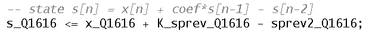

when "s_prev" and "s_prev2" mean s[n-1] and s[n-2] respectively. Next, power can be calculated as a Q32.32, three products of Q16.16 added (one of them subtracted):

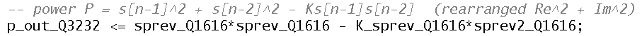

Q16.16 for the state value allows for growth of our order - 10^4 could be seen as a max with a generous pillow. 32 bits also can generously hold a power value on the order of 10^9. Rather than truncating such a value, to retain small values for testing of thresholds, I kept the output result a 64-bit word. Then the value will be compared with the 64-bit results from the other 7 resonator instantiations.

##### Appendix: Goertzel 
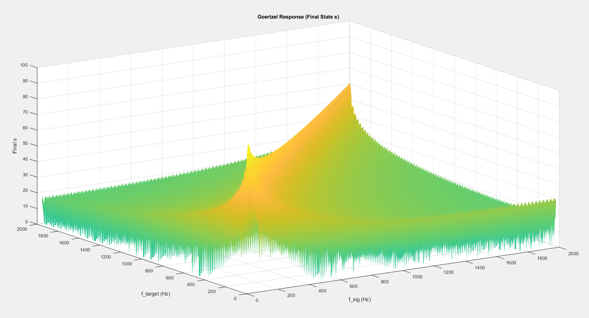
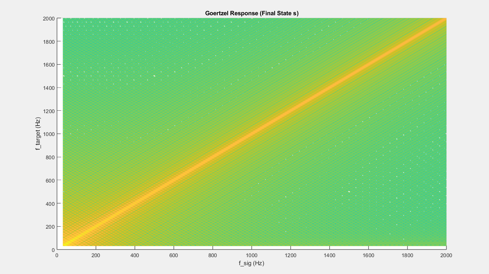
Figure 6. Final resonance state over both target and signal frequency. See how if the signal frequeny is the same as the target frequency, then the result is large and s grows fast. If they are different, it is small, so s would not grow big during the recursion window.

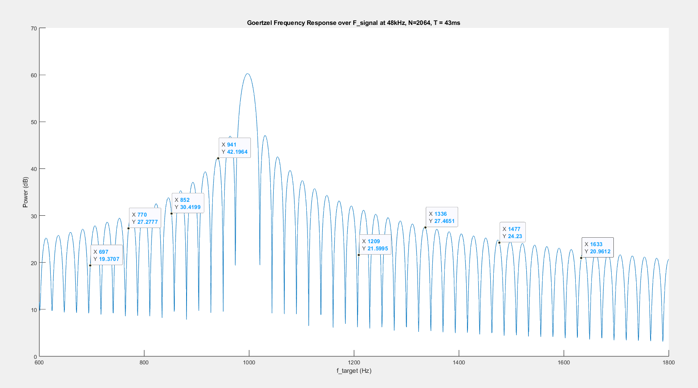
Figure 7. Power response and how well the gain lobes are optimized to the exact DTMF frequencies. This response is specific to the fact that we sample at 48 kHz and our window is 2064 samples long. See f_target = 697 Hz and 1209 Hz: Them responding halfway down the lobe (in decibels) is to say that, since they fall down to the left, if a tone only 10 Hz higher were played as the input, the resonance would be more efficient than if the target frequency were played. This is not the entire response, given our above figures. It is only to say that our resonators would have a better or more efficient time detecting 941 Hz than they would detecting 697 Hz. Power over target frequency and signal frequency can also be considered. 

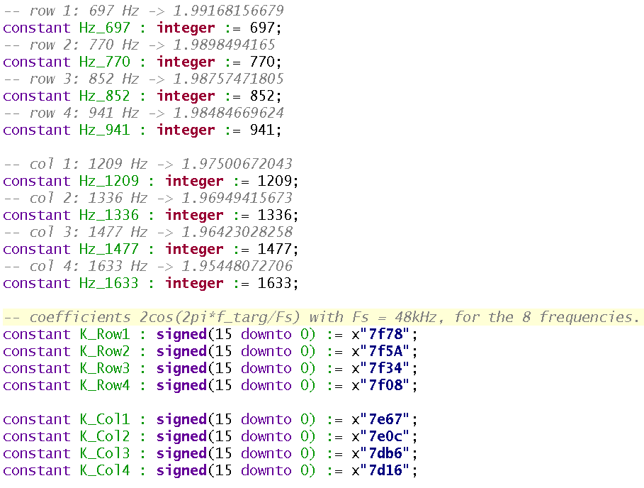
Figure 8. Coefficients defined in a package file. The frequencies are also defined integers, though their enumerations are just their frequency values, it is to prevent fat-fingering and to emphasize the constancy of the target frequencies for DTMF rather than whatever value someone wants. The lower target frequencies (like 697 Hz) result in a 2cosω = ~1.99, and the higher like 1633 Hz results in 2cosω = ~1.95.) They are defined in fixed point signed Q2.14, and called "K". Generics are defined for the Goertzel resonator units as the integer frequencies for readability the needed coefficient is selected with a multiplexer in each unit using the frequency generic as the select value.

