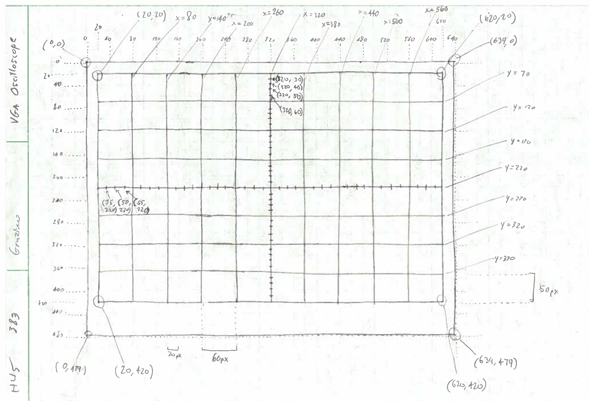
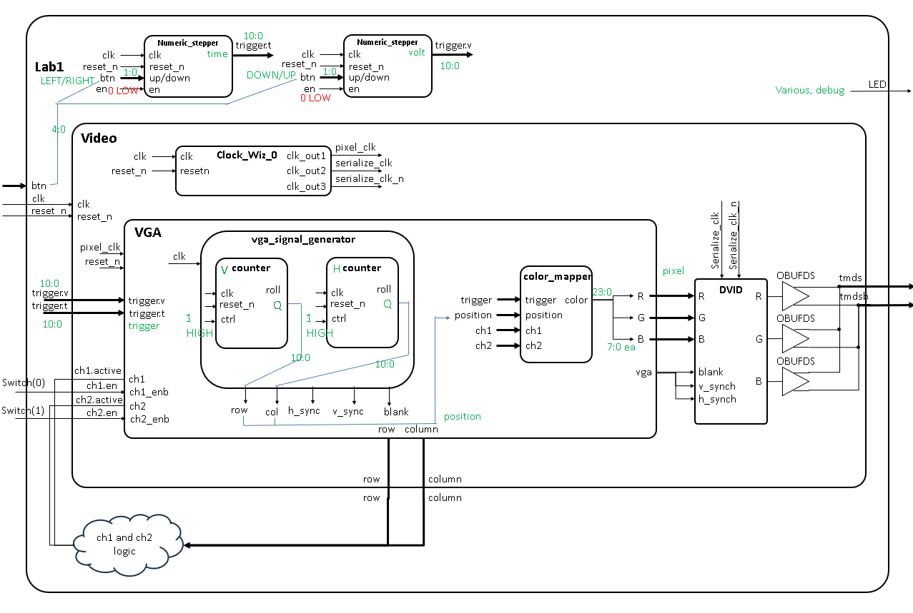

### Lab 1: Bruno Graziano, ECE 383

#### Introduction

We need to display a grid that is fitting for a two-channel oscilloscope on a 640x480 VGA screen. To test the channels, we will include two hard-coded lines that are enabled upon user input. There will also be trigger marks that are movable by the pressing of directional buttons. The horizontal axis will be time, and the vertical voltage. The VGA synchonization lab will consist of interfacing layers of modules that contribute to an overall design whose gluing of its interior components and logic of most interior components are entirely written by student.

#### Design/Implementation

##### Diagrams, from HW5 and block diagram

    

    

##### About each component

`vga_signal_generator` outputs an increasing position (increasing in columns one column a single pixel, according to the clock cycle, and after the highest column, ticking up a row, and after the highest row, ticking back to row 0 and column 0) as well as vga characteristic states like `h_sync` `v_sync` and `blank` with logic within that determines when during the row and column counts each signal would be high or low. The inputs are `clk` and `reset_n` and the outputs are `position` (a coordinate record of unsigned row and col) and `vga` (a VGA state record for `h_sync`, `v_sync` and `blank`).

`counter` (instantiated as two components, `h_counter` and `v_counter`) counts up to a certain maximum value using a number of bits, both specified as generics, and sends a rolling signal once the maximum value is reached while also accomodating for the 1-clock-cycle delay so that as the value ticks past the maximum the reciever of the roll signal would be able to already have their value tick by one. The generic integers are `num_bits` and `max_value`, the inputs are `clk`, `reset_n` and `ctrl` (to set what mode the counter is in), and the outputs are the `roll` signal and `Q` which is a vector of `num_bits` bits.

`color_mapper` is purely combinational and reads the position output by the `vga_signal_generator` and colors the current pixel based on whether we are on a gridline, a channel line, a hashmark, a trigger mark, or none of the above, and output the corresponding color. The inputs are `position` the coordinate record from `vga_signal_generator`, `trigger` which tells the mapper where the triggers are so it knows where to color as such, `ch1` and `ch2` which are channel records consisting on each channel's enable and active options, that is, whether each is turned on and whether the current pixel is the trigger mark's location, respectively.

`vga` holds all of the above inside itself. It is the entire module for the VGA interface - anything beyond it is extra to VGA. Its inputs are the `clk`, `reset_n`, and `trigger` (as sent from a higher module along with `ch1` `ch2`), and its outputs are `vga` (the VGA states from the `vga_signal_generator` and `pixel` which is a "pixel" record type, holding both the `color` and `position` of the current pixel.

`dvid` is an adapter VGA to HDMI. On our Nexys Video board we have only HDMI output ports, and we just built VGA interface.

`video` combines `vga` with `dvid` and outputs all things `vga` does to exclude `color` (but it still does have the `pixel` record's `position`) and with the addition of `tmds` and `tmdsb` (out) which are HDMI signals.

The `numeric_stepper` (as instantiated twice, one for volt axis and the other for time axis) is a portable module outside all of the above that when excited allows an incoming signal to be stopped if the previous of itself was also high. This means if a button were pressed, when put through this module, it will go back down low to not generate millions of "press" signals during a clock rate like ours (25 MHz). Instead of registering 5 million presses over 1/5 seconds of pressing a button, with this component we will register one button press. It is for moving the triggers across the screen for both time and volts. Being portable it has generics `num_bits`, `max_value`, `min_value`, `delta` (to change the output by upon each press), and the added `init_val` to which as it sounds like the output value will be initialized to upon reset. The inputs are the `clk`, `reset_n`, `en` (enable or disable the device, not touched in this lab), `up` (turn output value up), `down` (or down), and `q` (the output value).

And finally `lab1` is where the `numeric_stepper` modules are wired into the trigger values, and those are connected into the instantiated `video`. `ch1` and `ch2` are hardcoded here to test drawings, `ch1` as a yellow y=x line and `ch2` as a green y=(GRID HEIGHT)-x line. They make an X on the screen. `lab1` takes as input the `clk`, `reset_n` (as a button), `btn` (the rest of the directional buttons for the triggers), `sw` for `ch1` `ch2` enable or disable, and outputs `led` for debugging and `tmds` `tmdsb` HDMI out.

#### Test/Debug

##### Waveform screenshots

`h_sync` goes high, low, then high over `col` count:

`v_sync` goes high, low, and high over `row` AND `col`:

`blank` goes high, low, and high over `col` and `row`:

`col` rolls over, `row` increments:

Max for `col` and for `row`:

##### Problems encountered and fixes

- Not using `to_integer` on certain calculations. There is a lot of this in VHDL. If there are unsigned, it is best to make them integers when doing calculations with other integers on the right side of an assignment.
- Converting types simply: if converting unsigned to signed or to std_logic_vector, to any of the three to any of the other two, there is no need for a "to_...(...)" operator. The data just needs to be reinterpreted by VHDL, so prefix it with "unsigned(...) signed(...) std_logic_vector(...), like C typecasting.
- Not checking any imported test bench file for hardcoded values that steer the result away from your interest. Verifying constraint files as well can save time and hair.
- Forgetting to simulate properly: running the simulator for a specified amount of time ensures control and sanity, and that at least the problem is not with the simulator.
- Rolling over small details: don't choose to ignore them, like when `col` turns 0 (it rolls over), the `v_sync` and `blank` wait another single clk cycle to update accordingly and that was too much for the online simultor to display anything at all. Who would know then what an error like that would do to the bitstream generation?
- NOT ADDING "`if rising edge()`" in a `process(clk)`: It stripped a few hours from my life not knowing what I did wrong or was missing. Everyone who looked over mine missed it too. Process(clk) looks like enough; it is not. Need `if rising_edge(clk)`. It actually is a copypaste template in Vivado's lightbult papers, I think.
- Not paying attention to types when making wires/signals as glue. Things you thought were unsigned or logic vector could be entire records you thought about and while the simulation will work, the bitstream generation will not.

#### Results

Gate check 1 was achieved on time. The `counter` implementations to `vga_signal_generator` went well.

Gate check 2 was achieved partially on time - the `vga_signal_generator` was to be made in its entirety, to include the `vga` record states `h_sync` `v_sync` `blank`. There were no errors reported from the instructor's test bench, so it was a good submission, but I found later I had errors as stated above and fixed them at around the time or a bit later than the lab's Functionality was due. The problem was with the clock cycle delay on the vertical rollover.

Functionality was achieved but not on time. I did the required functionality and A functionality at the same time. The requirements are met now.

Evidence of Functionality which assumes working Gate checks can be found in Teams under SP26-M5 Trimble > Graziano > there is the video, and my repository is pushed to GitHub.

#### Conclusion

I learned how VGA is synchronized, and become more proficient in VHDL, Vivado, GHDL and other text editors. In Vivado specifically I learned more about how to search for hints on VHDL, and using the "IP Catalog" to find tools like the Clocking Wizard. I also learned how to make my own project in Vivado, though we did start that earlier than the lab in early homeworks. I learned more about the way Vivado or Tcl organizes RTL files, and the folders you have to click through to get to where you need to be in the Windows Explorer, and that this is not standard across VHDL or any hardware description, but it is a way of organizing the HDL files into "projects." In this lab I learned really what 383 is about (it's about building) and what this class asks of us.
