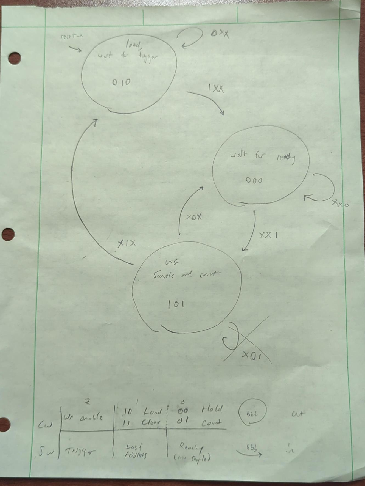

### Lab 2: Bruno Graziano, ECE 383

#### Introduction

Using the 640x480 VGA display and grid built in the last lab, the task at hand is to make an oscilloscope that may display the waveform of a line-in (AUX) signal. The `video` entity from Lab 1 is contained in this lab, and all things in it, but that outside of `video` has edited and built upon. New components built by the student include a trigger detector, a write-address counter, and a flag register (which is a surprise tool that we'll save for later). New componenets pre-fabricated and interfaced by the student include an SDP (simple dual port) BRAM for the left and right audio signals, and an audio codec including its own BRAM. The result is a triggered waveform generated on our screen from any AUX audio signal.

#### Design/Implementation

##### Diagrams

Finite state machine in the control unit.

##### Module Descriptions

`lab2`: Top file for entire lab build. Contains the datapath and control word (each below). Control and datapath are glued with the control word (control to datapath) and the status word (datapath to control). The datapath reads the control word and functions according to it, as the control reads the status word and functions according to it. Input `clk`, input `reset_n` (negated reset), input directional buttons `btn(5:0)` and 4 switches `switch(4:0)`, AC signals in and out (`ac_mclk`, `ac_adc_sdata`, `ac_dac_sdata`, `ac_bclk`, `ac_lrclk`, `scl`, `sda`), and HDMI out (`tmds`, `tmdsb`).

`lab2_fsm`: Control unit / finite state machine for the build. Stays at current state or switches to new state based on the status word `sw` and returns the control word `cw` that tells the data path what to do. The continuum of states is:
`load_wait_for_trigger` tells the write address counter (an entity below) to load its default load value (not 0 like a reset, a determined default value, this will be the first write address which is the same as the starting grid column). Writing to BRAM is disabled in this state. If `sw` from the datapath indicates that the trigger semaphore is satisfied, then this state is exited and `wait_for_ready` follows.
`wait_for_ready`: The write address counter to the BRAM is held, not incremented. Write to BRAM is disabled. If `sw` indicates the signal `ready` (see the `Audio_Codec`) is true, then the new signal is ready for processing and this state is exited and `wr_sampleandcount` is entered.
`wr_sampleandcount`: Writing to BRAM is enabled. The counter is told to count up by the output control word. This state is left immediately, into `wait_for_ready` or, if `sw` indicates that the current column (or BRAM address) is the last (rightmost) column on the grid, exit into `load_wait_for_trigger`.
Input status word `sw(2:0)` and output control word `cw(2:0)`. My build also has an input called `writeCntr_dbg`, which is the write address being counted, and that is for debugging live with the Vivado's Integrated Logic Analyzer (ILA). The `state` `sw` and `cw` are also signals that were debugged by that feature.

`lab2_datapath`: Datapath module glues nearly everything together. The inputs are `clk`, `reset`, all audio codec inputs, inputs that are abstracted into being unused until Lab 3, to include `exWrAddr` (external write address), `exWen` (ext. write enable) and `exLBus` `exRBus` external buses for L and R audio, `exSel` or external select mapped to the third `switch`, and the `flagClear` bit for the flag register. Relevant inputs to Lab 2 are the `cw` from the control unit, `sim_live` which is the fourth `switch`, channel 1 and 2 enables (within `ch1` `ch2` records) to switches 2 and 1 (they're oriented 0 the rightmost on the board so we go backwards), and the directional buttons for moving the triggers. The center button `btn(4)` went unused.
The outputs are all audio codec outputs, those being saved for later and unused like `tr_volt` (voltage trigger location), `tr_time` (time trigger location), `L_Bus_Out` `R_Bus_Out` for the audio (also outputs from the audio codec), `flaqQ` the Q of the flag register, and of course the HDMI `tmds` and `tmdsb` from the `video` component found below that lies in the datapath.
The inputs and outputs that are being "saved for later" will be used with a soft processor capability called MicroBlaze, accessible through Vivado's service, which will allow us to dictate functionality through instructions (C, programming language) as opposed to entirely through hardware description. These external signals would be accessed through MicroBlaze's register file. There are multiplexers that tell whether to use the external or internal signals going into the `DATAIN` and `WREN` (see BRAM), whose select bit is the switch that selects whether to use external signals, and it will be useful in the next lab.
The path of the data from the `Audio_Codec` to the `BRAM_SDP` will be told after the Audio Codec explanation and before the BRAM explainer so that it is readable. It will be through the `channel_t` clarifier below the part about `video`. The counter assembly (which includes its comparator and multiplexer for the write address, see the block diagram) will neither be explained now, even though it is not itself a whole component but a small component nearby two basic building blocks. It will help to explain it after the BRAM.

`Audio_Codec`: Called as instantiated in the datapath, but the entity name itself is `Audio_Codec_Wrapper` because it is a wrapper for the AC having so many generics, successfully abstracting them, along with an instantiation of a BRAM that includes a wall of hexadecimal digits that is not advisable to have to scroll past while working the lab. A similar design choice will be made on the `BRAM_SDP` modules' instantions into the datapath.

`video`: The same module from Lab 1, gluing the HDMI adapter capability to the `vga` which contains the `vga_signal_generator` that generates the counting rows and columns and the `color_mapper` which maps out the static display graphics, a grid with tick marks atop a black background. Input `clk`, `reset_n`, and `ch1` `ch2` (the records, consisting of an updated round of types since Lab 1, there is a list directly below this module). Outputs the HDMI `tmds` `tmdsb` and `position` the `coordinate_t` from Lab 1 consisting of (the current) `row` and `col`.

`channel_t` the record (that `ch1` and `ch2` are instantiations of) includes the following:
* `to_ac(18 bits)` which delivers audio to the AC to output to the line out AUX on the Nexus Video. Basically it means playable audio output coming from the FPGA. `from_ac` (below this) is assigned to this `to_ac` to loop back the audio being played into the FPGA to play it out into a speaker if the student would like.
* `from_ac(18)` fetches the current audio signal from the AC
* `incoming_sample(16)` is the current audio sample (`from_ac` after it is been through a register once and truncated to the most significant 16 bits) before it has been converted to unsigned (for the sake of printing onto the VGA screen that consists of all positive rows and column indices)
* `current_sample(16)` is the current audio sample after it has been made unsigned with a simple process of flipping the most significant bit that results in a half negative half positive (zero bias) signal fully positive and biased to +half its maximum amplitude making its minimum value zero.
* `prev_sample(16)` can be used by the trigger detector to decide whether the wave is currently increasing through the trigger point. More about this in the trigger module explainer some modules below.
* `to_bram(16)` is the value being sent to the bram at which ever write address is currently specified in the BRAM's other input, `write_address`.
* `from_bram(16)` is what the BRAM delivers given the current read address. 
Also important to note is that read/write addresses to the BRAM are 10 bits long (`RDWRADDR_WIDTH := 10`) and the values written are 16 bits long (`READWRITE_WIDTH := 16`). The BRAM addresses are the columns on the screen a values at an address is the row on the screen the current column dictates the current sample be printed.

`BRAM_SDP`: Instantiated twice through a wrapper component to prevent large generic instantitions from crowding the datapath file. Once for the audio Left and the other for the audio Right. These will become channels 1 and 2, yellow and green, respectively. Generics relevant to the datapath are `wrap_RW_WIDTH` which maps to `READWRITE_WIDTH (16)` and `wrap_RWADDR_WIDTH` which maps to `RDWRADDR_WIDTH (10)`. Input `wrap_RDADDR (10)` (read address), `wrap_RW_CLK` read+write clk which maps to `clk`, `wrap_RST` reset which maps to `reset`, `wrap_DATAIN (16)` which is the written data in, `wrap_WRADDR (10)` is the write address, and `wrap_WREN` is write enable. Outputs `wrap_DATAOUT (16)`. The read address points to the same element in the RAM as the write address. So, since columns are addresses in BRAM and rows are values in BRAM, the `position.col` from video will be mapped to the read address to get the correspondent row that was written to the address that was that column. 

`ch1` and `ch2` each active when their respective BRAM (L/R) `DATAOUT` = the current row generated by the `vga_signal_generator`. The column is mapped to the read address of the BRAM, so all that must be equal is the `row` to the `DATAOUT`. `DATAOUT` must be truncated to the same amount of bits as `row` in the `coordinate_t` record.

`address_counter`: The `write_address` which is mapped to BRAM's `WRADDR` input is counted with a counter from `lec10` entity, so it has a `clk`, `reset_n` and `ctrl` in, as well as the load value `D` in, and outputs `Q`. The values are the width of the `RDWRADDR (10)`. As controlled by `ctrl` it can hold, count, load any value or reset to all `0`.

`trigger_detector`: The previous sample (hence the register `chX.from_ac` had to go through) is compared while comparing the current sample, both to the trigger, for whether each is greater than or less than that threshold trigger value respectively, to discren whether the current sample is a trigger event (meaning the signal is increasing and crossing through the row of the voltage trigger and the start column of the grid at the same time. This will keep the wave still on the screen as long as the trigger is not out of bounds of the highest point on the signal).

`flag_register`: For Lab 3.
Input `flagClear` to reset the `flagQ` to 0, input `ready` (from `Audio_Codec`) to `set` (the input name on the register, it is not `ready`, it is `set`, but it is mapped to `ready`) the bit `Q`, which is mapped to `flagQ` an output also of the datapath itself.

#### Test/Debug

I mainly used bitstream generation and examining the VGA output to the screen, which given some distinct shapes of the simulation waves can be telling to what the problem is - for example if it is the still wave image from the BRAM's hex instantiation, I know my address counter is not counting, or the BRAM is continually being reset, or there is a freeze in the FSM, or anything that would make the address not count.

A possible solution to the above deserves a separate paragraph in that it is a very simple problem but hard to find if not looking for it. Make sure all component's reset ports are named according to whether they are active high or active low! If it is active low it should be called `reset_n`. Having a problem with this could result in a component being continuously reset and unusable.

Check vector lengths - draw it out if it is helpful and line up the bits of each one being transferred down the datapath. There is a lot of mutation of the audio signals on its way to being compared for `chX.en`, and a lot of opportunity for error there.

A new tool I used was Vivado's ILA which allowed a live signal to display while the programmed device is running. It was very useful for viewing states live which a friend's lab 2 test bench file could view non-live and so had limitations. A percieved limitation (I can't figure out how to get past it now) of the ILA is how short a time period its maximum sample period is - 131070, which is pretty long, but just short enough to not be able to see the counter roll over and the last address status word turn for the control unit to react. Being able to move the trigger to a far away time and sample the same amount of time would help with that. I did not solve the triggering problem I have, the wave will not trigger.

#### Results

Gate check 1,2,3: Did not finish on time. Finished GC 1, 2, and 3 at once on 22 Feb 2026. Uploaded a demo video for GC 1 2 and 3. As shown in this video, it output only the BRAM instantiation pattern. It was fixed shortly after this submission to display the live signal.

A-Functionality (but without triggering): The B and required functionality did not mention any distinctions over whether the triggering works in the first place, so mine can be called an A since it has all A requirements besides the signal being triggered. The triggers move and are debounced but the wave does not stand still. There are two waves, channel 1 and channel 2, yellow and green, for left and right channels. My counter load value is 20, so my intersection value with the trigger should be row 20 if it worked. Uploaded demo of that which was described both playing a song on each channel and viewing a ~220 Hz pure sine on both channels.

#### Conclusion

I learned on this lab more about interfacing with abstracted or more complex components. From Lab1, the only complex thing was the HDMI/DVID, but now we have the Audio codec and BRAM which both were best suited with wrappers, so it is good to have learned what wrappers are going forward, and it is very cool to now have made a real (almost) fully working oscilloscope that can view the waveform of any AUX input.
